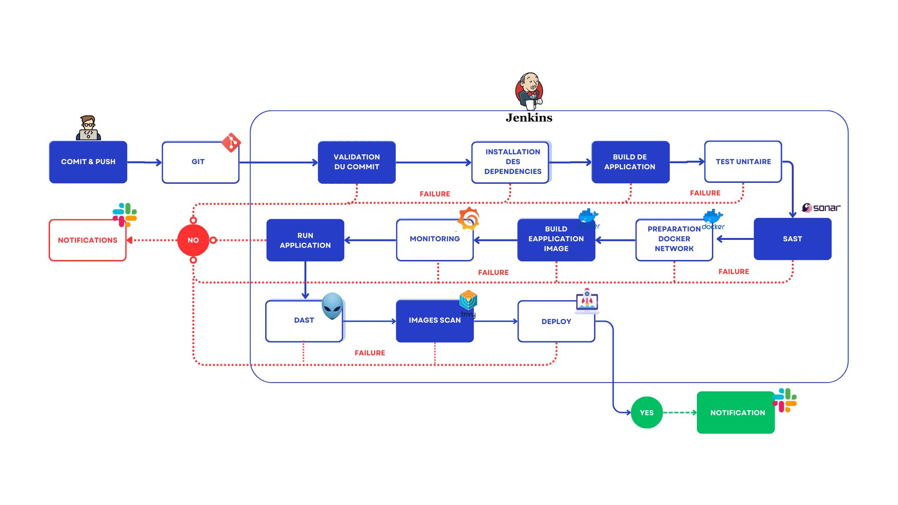

Secure CI/CD Pipeline

This repository contains a fully automated CI/CD pipeline designed to integrate software delivery with security best practices.
The pipeline includes code validation, automated testing, security analysis (SAST, DAST, image scanning), monitoring, and deployment, all orchestrated through Jenkins.

📌 Pipeline Architecture

  

🚀 Features
1. Build & Test Automation

Commit validation

Dependency installation

Application build

Unit testing execution

2. Integrated Security

SAST with SonarQube

DAST on the live application environment

Docker image scanning using Trivy

Failure gates at each critical stage

3. Containerization & Deployment

Docker environment preparation

Secure application image build

Deployment to the target environment

4. Monitoring & Observability

Application monitoring integrated into the pipeline

5. Notifications

Slack notifications for:

Pipeline failures

Successful deployment

Important pipeline events
